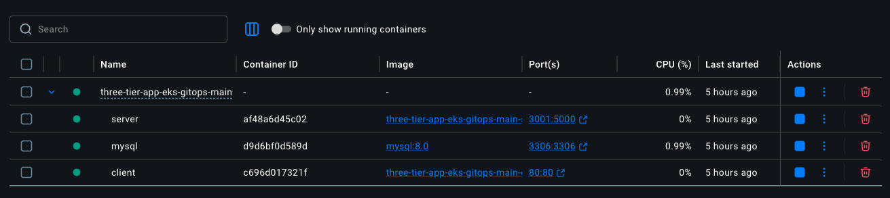
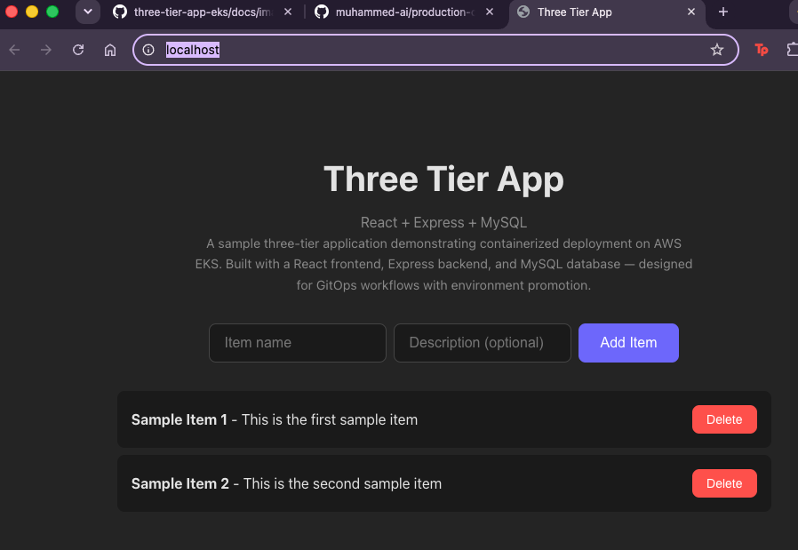

# Three-Tier Application on AWS EKS with DevSecOps Pipeline

[](https://github.com/muhammed-ai/three-tier-app-eks/actions/workflows/ci.yml)
[](LICENSE)


A production-ready three-tier application demonstrating modern DevOps and DevSecOps practices. Built with React, Express, and MySQL, deployed to AWS EKS through a fully automated CI/CD pipeline with environment promotion.

## Features

- **Full-Stack Application**: React frontend, Express.js API, MySQL database
- **Containerized**: Docker containers with multi-stage builds for optimized images
- **Kubernetes Ready**: Complete EKS deployment with auto-scaling and health checks
- **GitOps Pipeline**: GitHub Actions workflow with security scanning and automated deployments
- **Environment Promotion**: Retag-and-promote strategy ensures QA-tested artifacts reach production
- **Infrastructure as Code**: Terraform modules for reproducible infrastructure
- **Observability**: Prometheus metrics, Grafana dashboards, and CloudWatch integration

## Architecture


Incoming traffic flows through an Application Load Balancer (ALB) managed by the AWS Load Balancer Controller, which directs requests to ClusterIP services backing the application pods. Container images are promoted from QA to production without rebuilding, ensuring that the exact artifact tested in QA is what gets deployed to production.

## DevSecOps Highlights

| Practice | Implementation |
|----------|----------------|
| Image Scanning | Trivy vulnerability scanning in CI pipeline |
| Dependency Audit | npm audit and Snyk integration |
| Secret Management | AWS Secrets Manager + Kubernetes Secrets |
| Least Privilege | IAM roles for service accounts (IRSA) |
| Network Policies | Kubernetes NetworkPolicy for pod isolation |
| Image Signing | Cosign for artifact verification |
| SBOM Generation | Syft for Software Bill of Materials |

## Technology Stack

| Layer | Technology |
|-------|------------|
| Frontend | React 18, Vite |
| Backend | Node.js 20, Express.js |
| Database | MySQL 8.0 |
| Containers | Docker, AWS ECR |
| Orchestration | Kubernetes (AWS EKS) |
| CI/CD | GitHub Actions |
| IaC | Terraform |
| Monitoring | Prometheus, Grafana, CloudWatch |

## Project Structure

```
.
├── src/
│   ├── client/          # React frontend
│   │   ├── src/         # React components and logic
│   │   ├── Dockerfile   # Multi-stage build for production
│   │   └── nginx.conf   # Nginx reverse proxy config
│   └── server/          # Express.js API
│       ├── src/         # API routes and database logic
│       ├── tests/       # Unit and integration tests
│       └── Dockerfile   # Optimized production image
├── k8s/
│   ├── base/            # Base Kubernetes manifests
│   ├── qa/              # QA environment overlays
│   └── prod/            # Production environment overlays
├── terraform/
│   ├── modules/         # Reusable Terraform modules
│   └── environments/    # Environment-specific configs
├── .github/
│   └── workflows/       # CI/CD pipeline definitions
├── docs/
│   ├── adr/             # Architecture Decision Records
│   └── images/          # Diagrams and screenshots
└── scripts/             # Utility scripts for deployment
```

## Local Development

### Prerequisites

- Docker Desktop (or Docker Engine)
- Docker Compose
- Node.js 20+ (for local development without Docker)

### Quick Start

```bash
# Copy environment variables
cp .env.example .env

# Start all services
docker compose up --build

# Run tests
docker compose run --rm server npm test
```

Access the application:
- **Frontend**: http://localhost:80
- **API**: http://localhost:3001
- **API Health**: http://localhost:3001/health
- **Database**: localhost:3306 (user: appuser, password: apppassword)





## Running on AWS EKS

### Prerequisites

- AWS CLI configured with appropriate credentials
- kubectl configured
- Terraform 1.5+
- An AWS account with appropriate permissions

### Estimated AWS Costs

| Resource | Monthly Cost (approx.) |
|----------|------------------------|
| EKS Cluster | $73 |
| EC2 Worker Nodes (2x t3.medium) | $60 |
| RDS MySQL (db.t3.micro) | $15 |
| ALB + Data Transfer | $20-50 |
| **Total** | **$170-200/month** |

### Deployment Steps

```bash
# 1. Initialize Terraform
cd terraform/environments/dev
terraform init

# 2. Plan infrastructure
terraform plan

# 3. Apply infrastructure (creates EKS, VPC, RDS, etc.)
terraform apply

# 4. Configure kubectl
aws eks update-kubeconfig --name three-tier-cluster --region us-east-1

# 5. Deploy to QA (triggered automatically via CI/CD)
# Or manually:
kubectl apply -k k8s/qa

# 6. Promote to Production
kubectl apply -k k8s/prod
```

### CI/CD Pipeline

The GitHub Actions workflow automates:

1. **Build**: Compile and test application
2. **Security Scan**: Trivy, npm audit, SAST checks
3. **Package**: Build Docker images, generate SBOM
4. **Deploy QA**: Deploy to QA environment
5. **Integration Tests**: Run end-to-end tests
6. **Promote**: Retag and promote to production
7. **Deploy Prod**: Deploy to production environment

## API Endpoints

| Method | Endpoint | Description |
|--------|----------|-------------|
| GET | `/health` | Health check endpoint |
| GET | `/api/items` | List all items |
| POST | `/api/items` | Create a new item |
| GET | `/api/items/:id` | Get item by ID |
| DELETE | `/api/items/:id` | Delete item by ID |

## Monitoring & Observability

Access the monitoring stack:

- **Grafana**: http://grafana.your-domain.com (admin/admin)
- **Prometheus**: http://prometheus.your-domain.com
- **CloudWatch**: AWS Console > CloudWatch > Dashboards

Pre-built dashboards include:
- Application latency and error rates
- Pod resource utilization
- Database connection metrics
- CI/CD pipeline success rates

## Architecture Decision Records

Key architectural decisions are documented in [docs/adr/](docs/adr/):

- [ADR-001: Retag-and-Promote Deployment Strategy](docs/adr/001-retag-and-promote.md)
- [ADR-002: Multi-stage Docker Builds](docs/adr/002-multi-stage-docker.md)
- [ADR-003: Kubernetes Kustomize Over Helm](docs/adr/003-kustomize-over-helm.md)
- [ADR-004: AWS Load Balancer Controller](docs/adr/004-aws-load-balancer-controller.md)

## Key Takeaways

Implementing the environment promotion workflow highlighted the importance of image consistency: rebuilding container images for each environment introduces risk. By adopting a retag-and-promote strategy, the deployment process eliminates "works in QA but fails in production" issues.

## Roadmap & Future Improvements

- [ ] Blue/Green deployments for zero-downtime releases
- [ ] Chaos engineering with AWS FIS
- [ ] Cost optimization with Karpenter autoscaling
- [ ] Service mesh with Istio or Linkerd
- [ ] GitOps with ArgoCD or Flux
- [ ] Secrets rotation with External Secrets Operator
- [ ] Multi-region deployment for DR
- [ ] API gateway with Kong or AWS API Gateway

## Contributing

Contributions are welcome! Please read the [Contributing Guidelines](CONTRIBUTING.md) for details on our code of conduct and the process for submitting pull requests.

## License

This project is licensed under the MIT License - see the [LICENSE](LICENSE) file for details.

## Acknowledgments

- Inspired by the AWS Well-Architected Framework
- Built following the DevOps Handbook principles
- CI/CD patterns from GitHub Actions best practices

